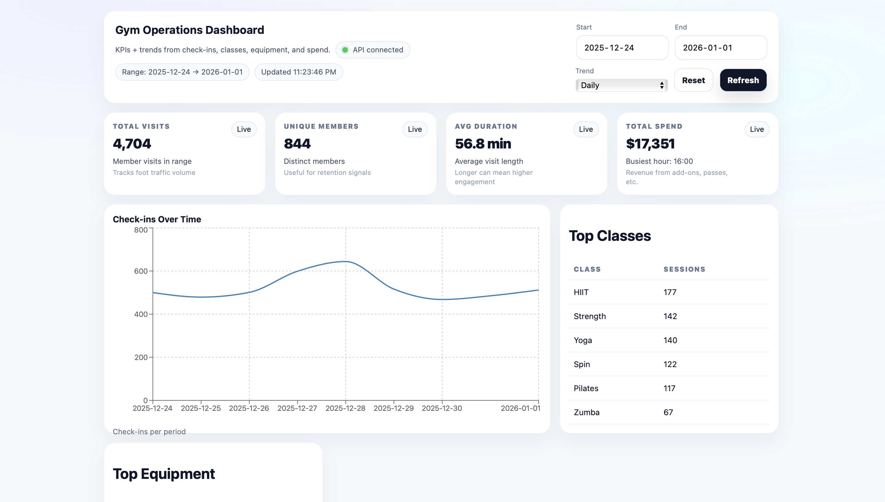

# Gym Operations Dashboard

A **SaaS-style internal dashboard** for tracking gym activity, engagement, and revenue across a selected date range.

> Uses **fake demo data** generated for portfolio purposes.

## Preview


## Why this project exists
Gyms generate a lot of operational data, but managers need **clear, fast insights**, not raw tables.
This dashboard demonstrates how raw events can be transformed into **actionable KPIs and trends**.

## Features
- Date range filtering (start / end)
- KPI cards:
  - Total visits
  - Unique members
  - Average visit duration
  - Total spend
- Trend chart (daily / weekly check-ins)
- Top classes and equipment usage
- Human-readable insights panel
- Loading and error states

## Tech Stack
**Frontend**
- React (Vite)
- Recharts
- Custom CSS (SaaS admin style)

**Backend**
- FastAPI (Python)
- SQLite

**Data**
- Synthetic gym events dataset
- Data cleaning + aggregation scripts

## API Endpoints
- `GET /kpis`
- `GET /trend/checkins`
- `GET /top/classes`
- `GET /top/equipment`

All endpoints support date-range filtering.

## Run Locally

### Backend
```bash
cd api
pip3 install -r requirements.txt
python3 init_db.py
python3 -m uvicorn main:app --reload

Open: http://127.0.0.1:8000/docs

Frontend
cd web
npm install
npm run dev

Open: http://localhost:5173